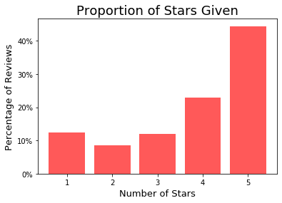
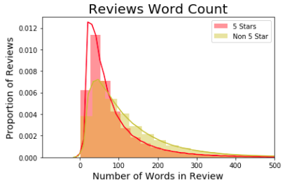
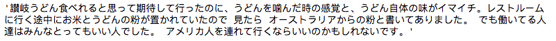
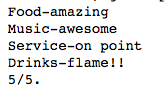
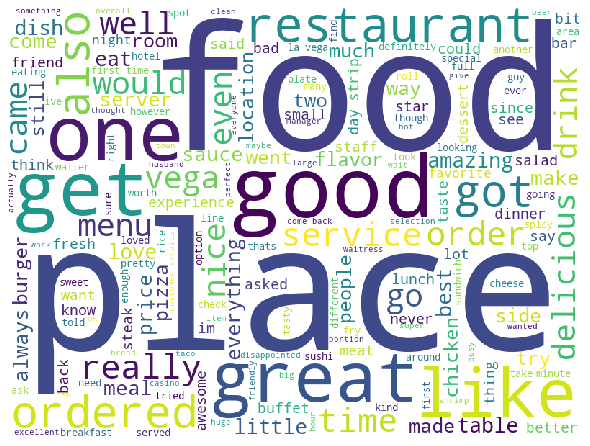
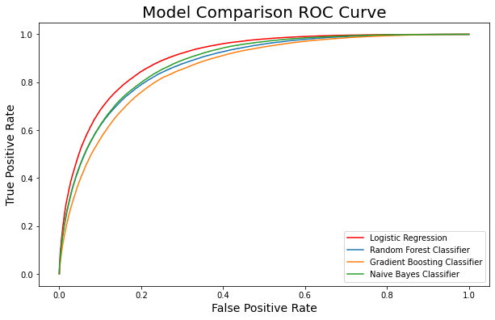
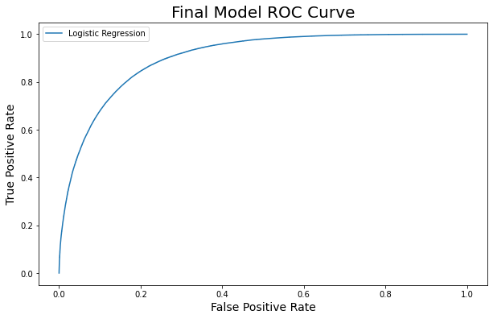

# Five Stars Reviews
**Ray Zhao**

### Table of Contents

* [Project Description](#description)
* [Data](#data)
* [Analysis](#analysis)
* [Processing of Reviews' Text](#NLP)
* [Model Comparison](#models)
* [Final Model Performance](#final)
* [Conclusion](#conclusion)

## Project Description

Yelp is a popular online directory of businesses that allows users to leave reviews and ratings ranging from 1 to 5 stars. The businesses can be filtered through many methods, such as restricting the business’ type, location or price. For Yelp to remain as a trustworthy review site, it must limit the fake 5 star reviews left by users to receive a gift from the businesses. Looking at the reviews for restaurants in Las Vegas, Nevada the goal is be predict if a review was given 5 stars based on the text of the review.

## Data

#### Source:
* Original JSON datasets obtained from [Kaggle](https://www.kaggle.com/yelp-dataset/yelp-dataset). 
* Overall the dataset contained 8 million reviews for businesses  spread across 11 metropolitan cities.
* The reviews dataset contained all the texts of the reviews along with a business_id that matched another dataset with all the businesses that contained business’ types and locations.

#### Cleaned Data:
| Features Name    | Description                                                 | Datatype |
|:-----------------|:------------------------------------------------------------|----------|
| Business ID      | Unique ID to match reviews with businesses                  | str      |
| Review ID        | Unique ID for each review                                   | str      |
| User ID          | Unique ID for each user                                     | str      |
| Review Text      | The text of the review                                      | str      |
| Stars            | The star rating for the review ranging from 1 to 5          | int      |
| Funny            | A count of how many users found this review to be "funny"   | int      |
| Useful           | A count of how many users found this review to be "useful"  | int      |
| Word Count       | A count of the number of words in the review                | int      |
| Language         | The language that the text of the review is in              | str      |

## Analysis

### Exploratory Data Analysis

For the 7310 restaurants in Las Vegas, there are 1.5 million English reviews.

#### The class balance is as shown below:

5 stars: 44.4%
Non 5 stars: 55.6%
* 4 stars: 22.8%
* 3 stars: 11.9%
* 2 stars: 8.4%
* 1 star: 12.4%

#### The Difference in Word Count

The average word count for 5 stars reviews is 86 words and 126 words for non 5 star reviews.

## Processing of Reviews' Text

#### Example of Non-English Review:

 

#### Example of Non-English Review:

 

* Lowercase the review
* Replace non-letters with spaces
* Tokenize the review
* Remove stop words
* Remove inflections

#### Example of tokens:
* 'food',  'amaze',  'music',  'awesome',  'service',  'point',  'drink',  'flame'

### Most Common Words Used

 

5 star Reviews:
great
love
best
delicious
amaze

Non 5 star Reviews:
good
get
like
Higher TFIDF of:
- food, place

## Model Comparison

| Model                | 1                     | 2                   | 3             | 4                 | 5           |
|----------------------|-----------------------|---------------------|---------------|-------------------|-------------|
| Method               | Baseline (Predicts 0) | Logistic Regression | Random Forest | Gradient Boosting | Naive Bayes |
| Features(vocabulary) | 1000                  | 1000                | 1000          | 1000              | 1000        |
| Accuracy             | 0.56                  | 0.82                | 0.79          | 0.78              | 0.80        |
| F1 Score             | 0.00                  | 0.80                | 0.76          | 0.74              | 0.77        |
| ROC-AUC              | 0.00                  | 0.90                | 0.88          | 0.86              | 0.88        |

## Final Model Performance

Training Accuracy: 0.821
Test Accuracy: 0.820
F1 Score: 0.798
ROC AUC: 0.902

#### Confusion Matrix

|                     | **Predicted Positive** | **Predicted Negative** |
|:-------------------:|:----------------------:|:----------------------:|
| **Actual Positive** |      108,708 (36%)     |       27,022 (9%)      |
| **Actual Negative** |       27,894 (9%)      |      141,886 (46%)     |

True Positives: Correctly predicted 5 star reviews
False Positives: Review might deserve 5 stars
True Negatives: Correctly predicted non 5 star reviews
False Negatives: Review might not deserve 5 stars

False Positives Stars:
* Total: 27,894

4 stars: 24,757 (89%)
3 stars: 2013 (7%)
2 stars: 654 (2%)
1 stars: 470 (2%)

## Conclusion

The final logistic regression model can be used to determine whether or not a review received 5 stars based on the text of a review. There is a large enough difference between 5 star reviews and other reviews to predict which have 5 stars. A few keywords that helped separate them were ‘best’, ‘great’, ‘love’, ‘delicious’ and ‘amaze’. The 5 star reviews that aren’t classified to be 5 stars can be further evaluated to see if it truly deserved to have 5 stars. Limiting the number of false 5 star reviews would increase the validity of any review site.

**To continue with this topic:**

Looking through these Yelp datasets was good practice for classification modeling. Hopefully soon I will be able to use this same dataset to build a recommender.
