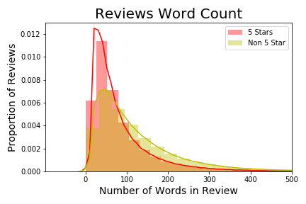

# FiveStarsReviews
**Ray Zhao**

### Table of Contents

* [Project Description](#description)
* [Data](#data)
* [Analysis](#analysis)
* [Processing of Reviews' Text](#NLP)
* [Model Comparison](#models)
* [Final Model Performance](#final)
* [Conclusion](#conclusion)

## Project Description

Yelp is a popular online directory of businesses that allows users to leave reviews and ratings ranging from 1 to 5 stars. The businesses can be filtered through many methods, such as restricting the type of business, location or price. The objective of this project is to look at the reviews for restaurants in Las Vegas, Nevada and predict if a review was given 5 stars.

## Data

#### Source:
* Original JSON datasets obtained from [Kaggle](https://www.kaggle.com/yelp-dataset/yelp-dataset). 
* The reviews dataset consists of 8 million reviews for businesses spread across 11 metropolitan cities.
* There are 1.5 million English reviews for restaurants in Las Vegas, Nevada.

#### Pipeline:
* .
* .
* .
* .

#### Cleaned Data:
* Dataset contains 1.5 million rows and ... features

| Features Name    | Description      | Datatype |
|:-----------------|:-----------------|----------|
| Business ID      |                  | str      |
| Review ID        |                  | str      |
| User ID          |                  | str      |
| Review Text      |                  | str      |
| Stars            |                  | int      |
| Funny            |                  | int      |
| Useful           |                  | int      |

| Word Count       |                  | int      |
| Language         |                  | str      |

## Analysis

### Exploratory Data Analysis

For the 7310 restaurants in Las Vegas, there are 1.5 million English reviews.

#### The class balance is as shown below:

5 stars: 44.4%
Non 5 stars: 55.6%
* 4 stars: 22.8%
* 3 stars: 11.9%
* 2 stars: 8.4%
* 1 star: 12.4%

#### The Difference in Word Count

## Processing of Reviews' Text

#### Example of Review:

 

…
Example of Non-English Review:
…
Example of tokens:
...

## Model Comparison

**MODEL CHART HERE**
...
...
...

## Final Model Performance

## Conclusion

This is my conclusion

**To continue with this topic:**

This was in hope to build a recommender in the future. 
